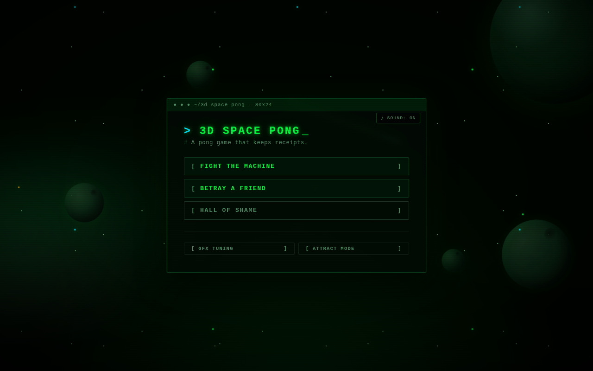
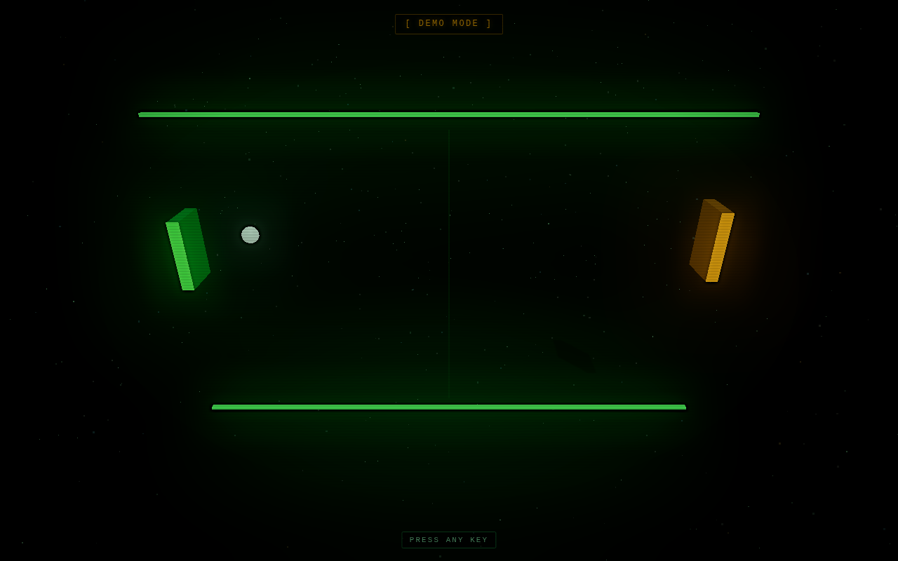
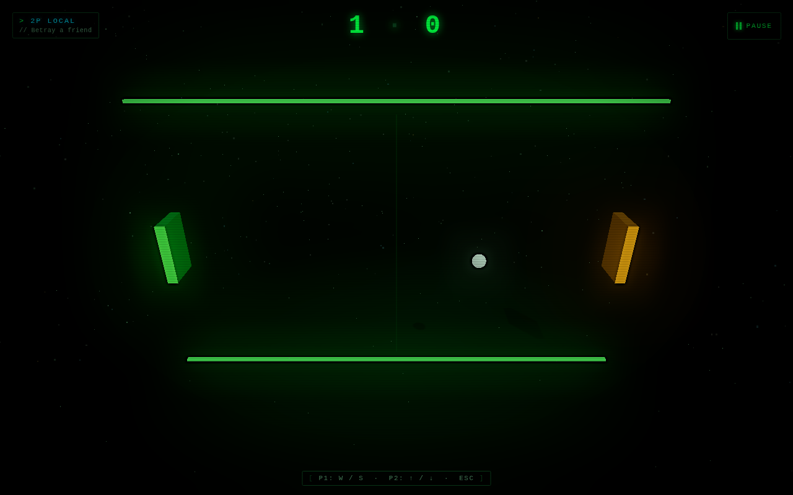
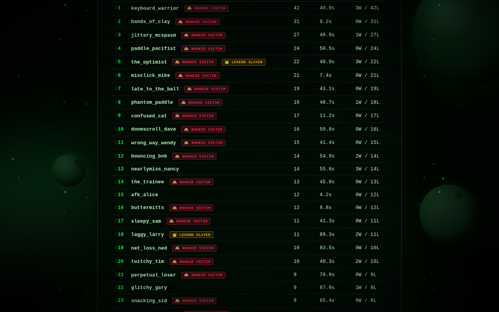

# 3D Space Pong

> A 3D Space Pong game that keeps receipts.

Open-source 3D Space Pong, built with [three.js](https://threejs.org/) for the game and [parallax.js](https://matthew.wagerfield.com/parallax/) for the layered background. One-page web app, 1P vs AI (5 difficulty levels) or 2P local. Tracks every match against the computer — wins **and** losses — in a Hall of Fame *and* a Hall of Shame.

## Features

- 🎮 **Two modes** — 1P vs AI, 2P local (split keyboard)
- 🤖 **Five AI difficulty levels** — from Rookie ("has never held a paddle before") to Legend ("is the source code")
- 💀 **Wins AND losses tracked** — losing to Rookie earns you a permanent badge of shame
- 🌌 **Parallax background** — layered depth on every screen via parallax.js
- ✨ **Bloom post-processing** — neon vibe via three.js `UnrealBloomPass`
- 📦 **Dockerized** — single container, single bind mount, perfect for self-hosting on Unraid
- 🗄️ **SQLite by default** — zero-config, single file, runs anywhere
- 🛠️ **Drizzle ORM** — type-safe schema, swappable to Postgres later

## Screenshots

Captured from a real headless-Chromium run of the built app (server serving the built web bundle), in both light and dark `prefers-color-scheme`. The game currently renders the same fixed dark neon theme either way — it doesn't read `prefers-color-scheme` yet — so the light/dark pairs below look identical on purpose; that's a known gap, not a capture bug.

| Menu | Attract mode (demo) |
| --- | --- |
|  |  |

| Gameplay (2P local) | Hall of Shame |
| --- | --- |
|  |  |

More PNGs (including the `-dark` variants) live under [`docs/assets/screenshots/`](docs/assets/screenshots/). Regenerate them with [`scripts/screenshots.mjs`](scripts/screenshots.mjs):

```bash
# with the app already running at BASE_URL
docker run --rm --network host \
  -v "$PWD/scripts:/work/scripts:ro" \
  -v "$PWD/docs/assets/screenshots:/out" \
  -w /work \
  mcr.microsoft.com/playwright:v1.55.0-noble \
  bash -c "npm init -y >/dev/null && npm install --no-save playwright@1.55.0 >/dev/null && \
    node /work/scripts/screenshots.mjs --base-url=http://localhost:3000 --out-dir=/out"
```

## Tech stack

| Layer       | What                                |
| ----------- | ----------------------------------- |
| Frontend    | TypeScript + Vite + three.js + parallax.js |
| Backend     | Fastify + Drizzle ORM + better-sqlite3 |
| Validation  | Zod schemas (shared client/server)  |
| Container   | Docker + docker compose             |
| License     | MIT                                 |

## Project layout

```
3d-space-pong/
├── packages/
│   ├── shared/   # zod schemas + types shared by client and server
│   ├── server/   # Fastify API + Drizzle ORM + SQLite migrations
│   └── web/      # Vite + three.js + parallax.js front-end
├── Dockerfile
├── docker-compose.yml
└── README.md
```

## Run locally

### Requirements

- Node.js 20+
- pnpm 9+ (`corepack enable && corepack prepare pnpm@9.0.0 --activate`)

### Option A: dev mode (recommended)

```bash
pnpm install
pnpm dev
```

This starts:

- Vite dev server on **http://localhost:5173** (the front-end)
- Fastify API on **http://localhost:3000** (the back-end)

Vite proxies `/api/*` to the API, so the front-end always talks to `/api/...` regardless of the environment. `pnpm dev` runs the server with `tsx`, straight from `src/`, so migrations run automatically against `packages/server/src/db/migrations` on every start.

### Option B: build once, run the compiled server

```bash
pnpm install
pnpm build
pnpm --filter @3d-space-pong/server run db:migrate   # see note below
node packages/server/dist/index.js
```

The single Fastify server then serves both `/api/*` and the built web bundle on `http://localhost:3000`.

> **Known gap:** `pnpm build` (via `tsc`) does not copy the raw `.sql` migration files into `packages/server/dist/db/migrations`. The Docker image works around this with an explicit `COPY` step (see [`Dockerfile`](Dockerfile)), but a plain local `pnpm build && node dist/index.js` will silently skip migrations and 500 on first API call ("no such table: ..."). Run `pnpm --filter @3d-space-pong/server run db:migrate` first (it runs against `src/db/migrations`, so it always finds the SQL) to work around it until the build script copies the migrations folder itself.

### Hitting the dev server from another machine

Vite is configured with `host: true`, so it binds to `0.0.0.0`. From another device on your LAN, open `http://<your-machine-ip>:5173`. The browser must support WebGL — most modern desktop and mobile browsers do.

### Database

A fresh SQLite database is created automatically (parent directories included) at the path in `DB_URL` — `packages/server/data/pong.db` by default — on first run.

To regenerate migrations after changing `schema.ts`:

```bash
pnpm db:generate
```

## How to make it our problem (self-host)

### Docker compose (one-liner)

```bash
docker compose up --build -d
```

Then open **http://<your-server>:3000**. The SQLite file is persisted in `./data/pong.db` via a bind mount, so `docker compose down && docker compose up` keeps your data.

### Unraid

1. Clone this repo to a folder on your server (e.g. `/mnt/user/appdata/3d-space-pong`).
2. From that folder, run `docker compose up -d --build`.
3. Map host port `3000` (or whatever you prefer) and bind-mount `./data` to keep the database between container restarts.
4. Optionally put it behind your reverse proxy of choice.

### Environment variables

| Variable     | Default                       | Notes                                       |
| ------------ | ----------------------------- | ------------------------------------------- |
| `PORT`       | `3000`                        | HTTP port the server listens on             |
| `HOST`       | `0.0.0.0`                     | Bind address                                |
| `DB_DRIVER`  | `sqlite`                      | Currently only `sqlite` is implemented      |
| `DB_URL`     | `file:./data/pong.db`         | SQLite file path (use `file:` prefix)       |
| `LOG_LEVEL`  | `info`                        | Pino log level                              |

Postgres support is wired into the schema layer but not yet bundled — open an issue if you need it.

## API

| Method | Path                                                           | Purpose                          |
| ------ | -------------------------------------------------------------- | -------------------------------- |
| GET    | `/api/health`                                                  | Healthcheck (returns vibes)      |
| POST   | `/api/signup`                                                  | Create or update a user (upsert by email) |
| POST   | `/api/matches`                                                 | Record a 1P-vs-AI match result   |
| GET    | `/api/leaderboard?sort=wins\|losses\|ratio\|shortest_loss\|rookie_victims&difficulty=...&limit=20` | The Hall of Fame, Shame, and everything in between |

All POST bodies are validated with Zod schemas from `@3d-space-pong/shared`.

## Controls

| Player        | Up    | Down  |
| ------------- | ----- | ----- |
| Player 1 / Human | `W`   | `S`   |
| Player 2         | `↑`   | `↓`   |

In **1P vs AI** mode, P1 controls the human paddle and the AI controls the right side. In **2P local**, both players share one keyboard.

## Humor as a feature

The whole app is quietly roasting you. All player-facing copy lives in [`packages/web/src/content/quips.ts`](packages/web/src/content/quips.ts) — non-developers can PR jokes there without touching game logic. Design rules:

1. **Dry over loud.** Portal/Stanley-Parable voice, not meme energy.
2. **Mock the situation, never the player.** The app is self-aware, not mean.
3. **Errors stay clear.** Network errors are plain English; humor lives in flavor only.
4. **Never lie about game state.** Score is score. Flavor is flavor.

## Contributing

Contributions, bug reports, and especially **new quips** are welcome. Add jokes to `quips.ts`, open a PR, profit.

## License

[MIT](LICENSE) — do what you like, just don't blame us when you lose to Rookie.
